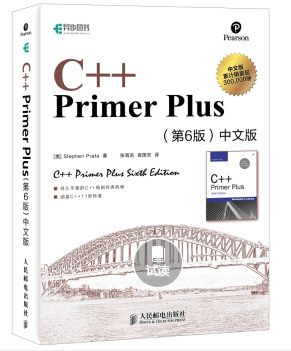
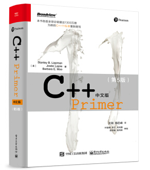

# C++ 

专业：计算机类、信息专业全体；  

时间：大一下；  

讲师：徐艳艳、王春玲、王少荣等；  

---

## 授课教材  

《C++ Primer》、《C++ Primer Plus》5-6th，**不建议一上来就抱着大部头啃，等于劝退！**；    

    

    

二者的区别，引用豆瓣用户书评：  

> 《Plus》可以说是一本面向从未学习过C语言甚至是从未学习过编程的人的入门书籍，它的第一章从基础内容讲起，先介绍了传统编程的规则，后面才着重讲解有关面向对象——C++的精髓之一——的有关内容。整个书的结构安排较为合理，难度爬升较慢。  
>
> 而《C++ Primer》我认为是一本针对有编程基础（尤其是C基础）的读者的。我只看过PDF版本，其第一章就已经涉及到了一些抽象的概念，不利于初学者接触。这也正是我力荐这本书的缘故。

推荐C语言基础不错的(期末85分+)同学，直接买 Primer，当然电子版也行。   

这两本书的电子版因版权原因，在计协FTP服务器：`ftp://202.204.121.93/计算机教学资料/` Book书目录中。   

---

## 课程评价

C++范式多，特性多，学习时间漫长，学习曲线陡峭。而且相较初学编程时的C语言老师们，C++老师讲课时会忽略一些细节，所以需要自己在练习方面比入门C语言时多花一些功夫。

知识点：C++ 基本语法、数据结构(struct等)、C++ 类 & 对象、继承、重载运算符和重载函数、多态、数据抽象、数据封装、接口（抽象类）、文件和流、动态内存、C++ 模板 、C++ STL 教程 等等。   

**考试：** 上机考试，基本上就是上面的知识点内容。   

## 自学方法

推荐学习顺序：入门视频 + 随视频练习 --> 看书 + 书后有水平的练习题 --> 视频或书上的实战入门小项目； 

### 入门视频

* 中国大学Mooc  [C++程序设计 国家精品 西北工业大学 魏英](https://www.icourse163.org/course/NWPU-494001) : 离线版在计协FTP 计算机教学资料 视频目录中，C语言基础好的，建议从第 20讲开始看；  
* 学堂在线  [C++语言程序设计基础 国家精品 清华大学 郑莉等](http://www.xuetangx.com/courses/course-v1:TsinghuaX+00740043X_2015_T2+sp/about) 和 [C++语言程序设计进阶 国家精品 清华大学 郑莉等](http://www.xuetangx.com/courses/course-v1:TsinghuaX+00740043_2x_2015_T2+sp/about) ，该课有随堂模式，这里的链接都是自主模式的，建议选择随堂模式。  
* 慕课网  [C++ 远征系列](https://www.imooc.com/course/list?c=cplusplus&sort=pop)   

### 书籍推荐

* 《C++ Primer》、《C++ Primer Plus》等经典工具类书。这类书讲解基本语法，使读者对C++能窥其全貌；   
* 《STL源码剖析》。此书讲解SGI STL的实现，可以结合数据结构一起看。（书中绝大部分内容已过时）；   
* 《深度探索C++对象模型》。此书讲解C++面向对象程序设计的底层机制，包括结构式语意、临时性对象的生成、封装、继承，以及虚拟——虚拟函数和虚拟继承（书中某些描述不够准确）；
* 《Effective C++》、《More Effective C++》。此类书讲解最佳实践。建议挑着快速浏览一遍（书中某些条款已过时）；  

### 入门练手  

* 书中一些章节后的小项目；  
* [牛客网 C/C++ 专项练习](https://www.nowcoder.com/intelligentTest)  
* [实验楼免费项目](https://www.shiyanlou.com/courses/?category=all&course_type=all&fee=free&tag=C%2B%2B&unfold=0) 包括：C++11/14快速上手、C++ 实现 STL 标准库和算法、C++ 实现俄罗斯方块、C++ 解决迷宫问题、C++ 使用 openGL 实现吃豆人游戏等；  
* [RosettaCode C++](http://rosettacode.org/wiki/Category:C++)：rosettacode 上的各种 C++ 代码实现；   
* [B 站 C++ 实战类视频](https://search.bilibili.com/all?keyword=C%2B%2B%20%E5%AE%9E%E6%88%98)  

## C++ 相关资料

* [cppreferece](https://en.cppreference.com/w/Main_Page)
* [C++ tutorials](http://www.cplusplus.com/doc/tutorial/)   
* [C++ reference](http://www.cplusplus.com/reference/)  
* [C++ 菜鸟教程](http://www.runoob.com/cplusplus/cpp-tutorial.html)  
* [C++ w3schools](https://www.w3schools.in/cplusplus-tutorial/)  
* [知乎：《C++ Primer》和《C++ Primer Plus》有哪些区别？](https://www.zhihu.com/question/21188013)   
* [牛客网：C++ 教材全解](https://www.nowcoder.com/schoolbooks?type=2)   

## 进阶

**写在前面：** 从应付考试的角度来说，草草的翻过一边《C++ primer》之类的书就已经很稳了，以下内容写给对计算机底层以及C++感兴趣的同学(请自行判断是否是叶公好龙，及时止损。计算机专业方向很多，没必要死磕)。

* 了解C++标准
  
  编程语言规范(或标准或定义)是一种文档，它定义了一种编程语言，以便用户和实现者能够就该语言中的程序的含义达成一致。C++也是由标准定义的一门编程语言，由ISO C++委员会制定标准。但不建议直接翻标准，大部分人不需要成为语言律师，所以大家对某些语义或者标准库的行为不明确，上[cppreference](https://en.cppreference.com/w/Main_Page)这个网站查就够了。
  
  标准也不可能做到覆盖整个C++的方方面面，即不能把所有行为都明确规定下来，所有有了implementation-defined behavior,undefined behavior,unspecified behavior。

  > 3.4.1 1 implementation-defined behavior unspecified behavior where each implementation documents how the choice is made
  > 2 EXAMPLE An example of implementation-defined behavior is the propagation of the high-order bit when a signed integer is shifted right.
  >
  > 3.4.3 1 undefined behavior behavior, upon use of a nonportable or erroneous program construct or of erroneous data, for which this International Standard imposes no requirements
  > 2 NOTE Possible undefined behavior ranges from ignoring the situation completely with unpredictable results, to behaving during translation or program execution in a documented manner characteristic of the environment (with or without the issuance of a diagnostic message), to terminating a translation or execution (with the issuance of a diagnostic message).
  > 3 EXAMPLE An example of undefined behavior is the behavior on integer overflow.
  >
  > 3.4.4 1 unspecified behavior use of an unspecified value, or other behavior where this International Standard provides two or more possibilities and imposes no further requirements on which is chosen in any instance
  > 2 EXAMPLE An example of unspecified behavior is the order in which the arguments to a function are evaluated.

  谭浩强的书为什么被这么多人喷？很大一部分原因就是因为他无视标准的存在，把C/C++当黑盒测试，通过VC6.0的实现反向推测规定(比如经典的`i = i++ + ++i`)，本末倒置。
  
  C++现在最新的标准是C++17，C++20也快来了。推荐大家看下《effective modern C++》，讲解C++11/14的书。C++11/14在语法上新增了右值引用、移动语义、lambda表达式等，在标准库里也加了正则、文件、线程等内容，改动还是特别大的。嗯，趁着他还不是标题党，讲的还算是modern C++，大家都看下这本书吧。
  
* 了解平台相关的内容

  C++作为系统级语言，直接跟OS、ISA打交道。虽然严格来说这些内容不属于C++，但是想用好C++就得了解它们，否则跟那些带虚拟机的语言有什么区别？虽然软件工程强调分层，但想学好某一层必须得上下贯通才行。比如C++的特色之一：无gc，手动管理内存(不过好在有RAII和智能指针，足以实现大部分任务)，但你连进程的内存分布都不明白，搞不懂哪分配在栈上哪分配在堆上，怎么能指望你写好C++呢？
  
  我觉得需要了解的内容大致如下：
  
  + 编译链接模型。这里C++基本就是沿袭的C的编译链接模型（模板库比较特殊，都是以源码方式分发的）。了解静态库、动态库、目标文件的概念，怎么链接成可执行文件，系统又如何加载可执行文件等概念。这块内容可以看[《程序员的自我修养》](https://book.douban.com/subject/3652388/)一书，挑一个自己熟悉的平台了解(Linux或者windows)。
  
  + C++的[ABI](https://en.wikipedia.org/wiki/Application_binary_interface)。主要就是《深度探索C++对象模型》的那些内容，但如前面所说，那本书其实比较老，书上例子里的编译器现在都没人用了。建议直接明确一个平台和常用的编译器，了解它的ABI(虽然不同编译器版本的ABI都可能不同)。主攻Linux的童鞋可以直接看[Itanium C++ ABI](https://itanium-cxx-abi.github.io/cxx-abi/)。学了这些，你才能明白C++的OO是如何做到Zero-overhead Abstraction的。才能看到Rust所宣称的zero-cost abstractions，不被唬住而会心一笑。
  
  + 操作系统和CPU的基本工作原理。OS还是在Linux和windows里主攻一个。CPU了解X86就够了，毕竟PC和服务器基本都用它。
  
* 练习
  
  可能有人觉得光学玩C++啥都干不了，想练习又不知道写什么。其实很好办，我也是从某个大佬那里学来的：“不知道写什么练手？用过vector吗，写一个。”（而且C++大部分都是模板库，一般在IDE里ctrl+左击就能看到源码中的定义）。
  
  
  
## 从入门到入土

  写到这，C++中的黑魔法、噬魂怪终于要登场了——那就是模板元编程。不知道是巧合还是故意设计的结果，C++的template是图灵完备的。据说它是比较蹩脚的函数式编程，基本就是实现了pattern matching的语义。这方面我也不太了解了。有兴趣的同学可以深挖下去，这又是一片新的天地...
  
