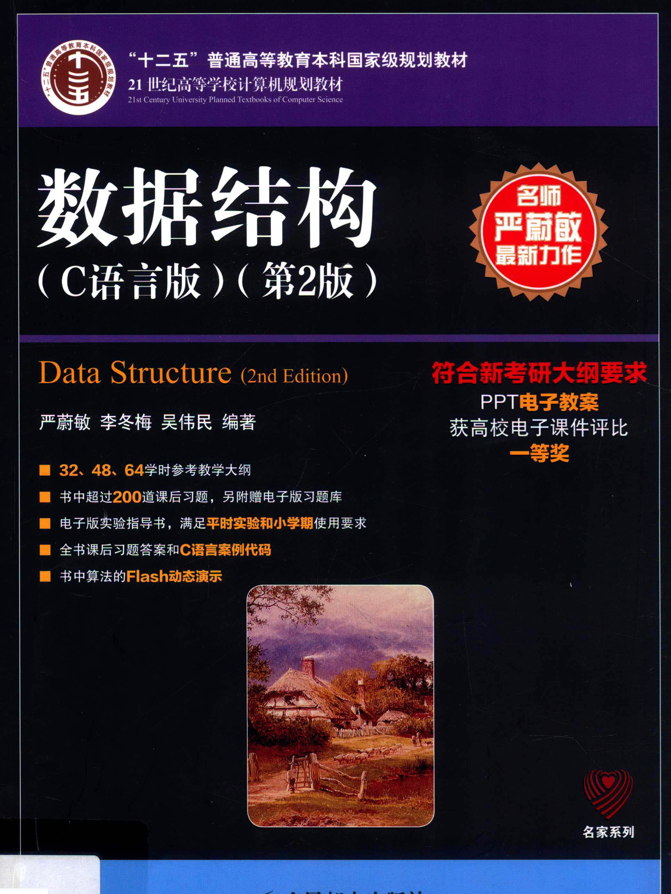

# 数据结构与算法 

专业：信息院所有专业 
时间：大二上  

2015级教师：李冬梅老师 韩慧老师 

教材：下面有图（数据结构 C语言版 第2版）

期末考试题目量大且闭卷，写程序的实验，课设   

C语言的实验OJ参考代码[在这里](https://github.com/yiran7324/BFU-leaf/tree/master/%E6%95%B0%E6%8D%AE%E7%BB%93%E6%9E%84%E4%B8%8E%E7%AE%97%E6%B3%95/OJ%E4%BB%A3%E7%A0%81)。原仓库是[这里](https://github.com/yiran7324/bjfu-data-structure)，除了OJ代码，那里还能找到大作业。

# 由于版权原因，电子版书，在知识星球里

教材高清图：

