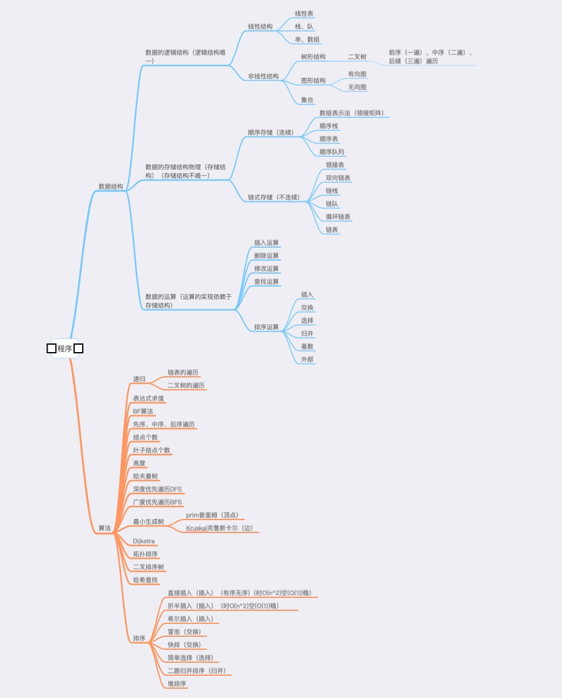
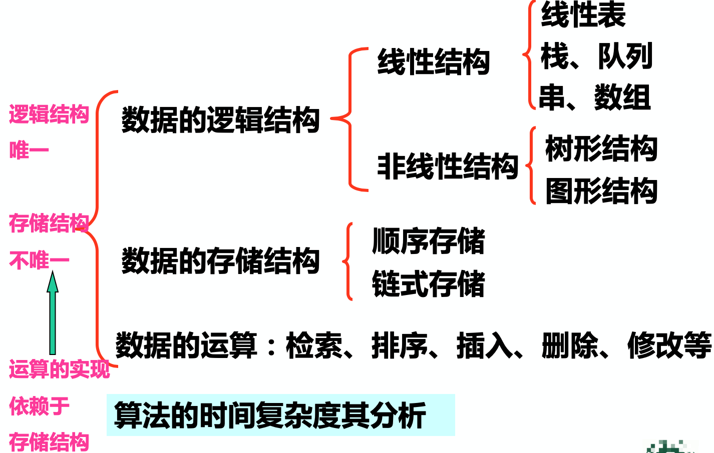
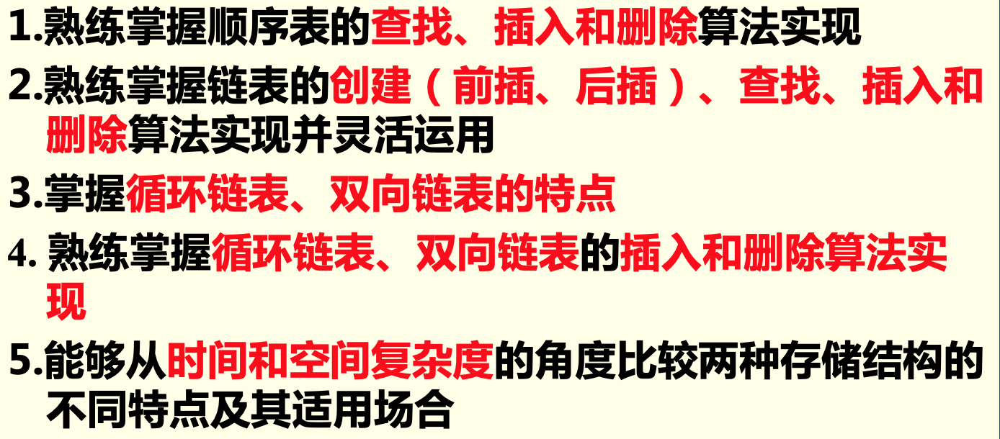
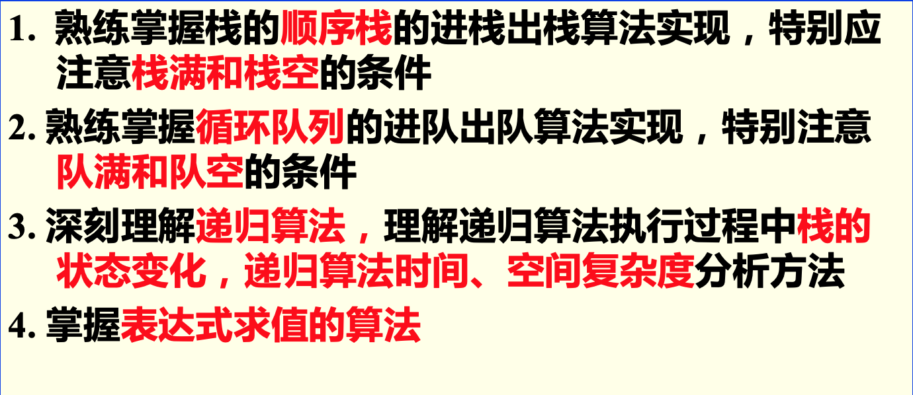
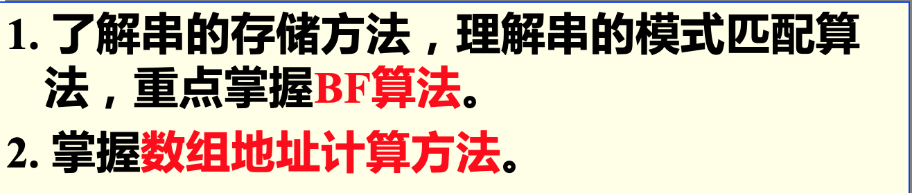
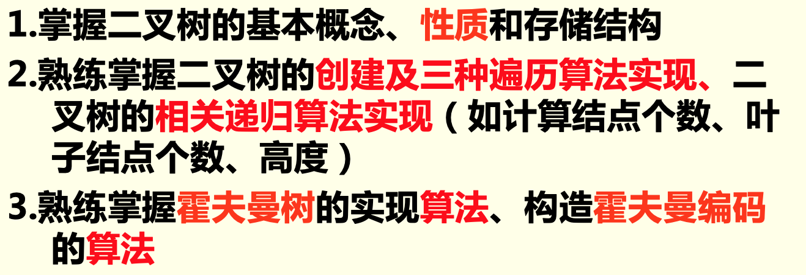
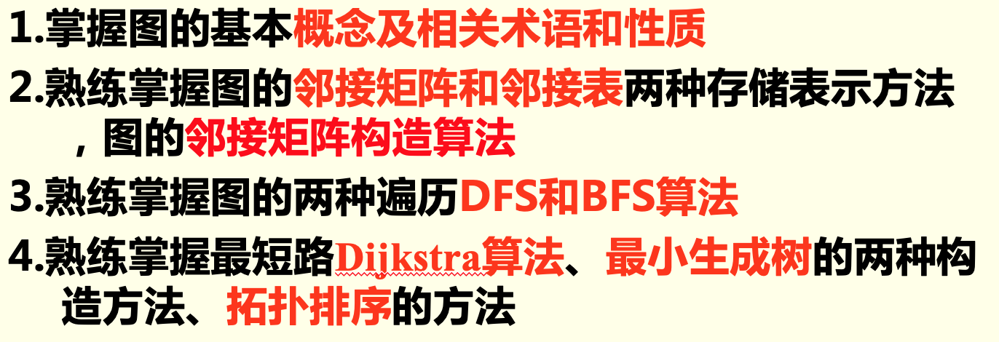
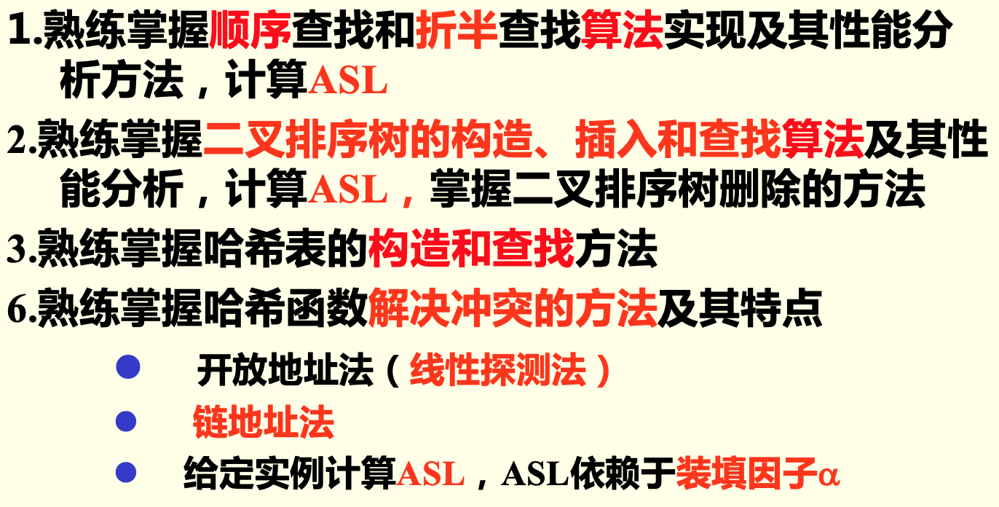
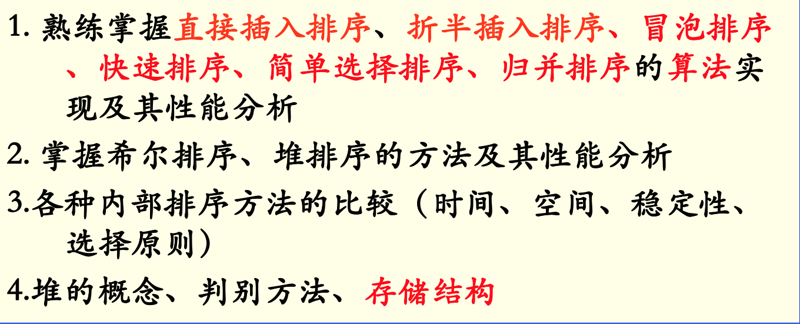
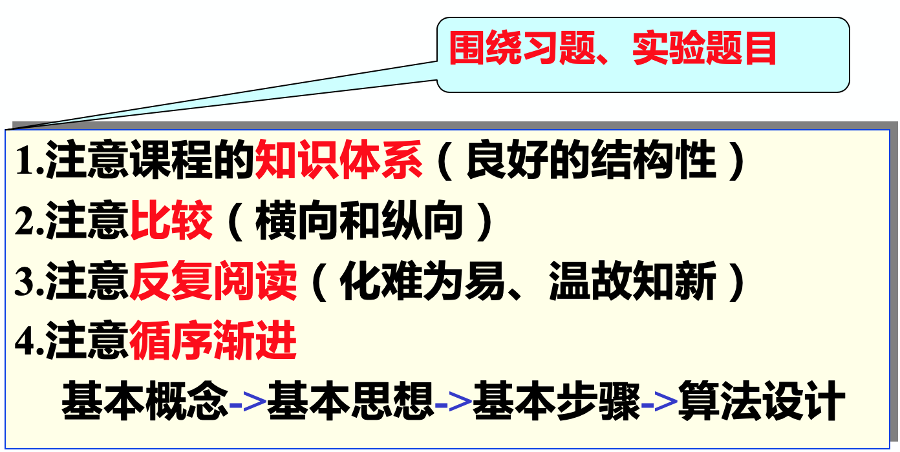

# 总括

习题必做(放在习题文件夹里)
[刷题网站](http://www.bjfuacm.com/structure/)

**期末考试题型**

1、选择题  

2、判断题  

3、填空题  

4、应用题  

5、算法设计题（程序填空和编写程序）  

第1章　绪论  

第2章　线性表  

链表相关算法习题  

1.实验１（创建、插入、删除、查找、最大、逆转）  

2.链表的合并    

第3章　栈和队列  

第4章　串、数组  

第5章　树和二叉树  

第6章　图  

第7章　查找  

第8章　排序  

**复习方法指导**

