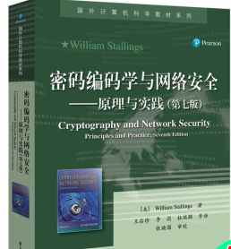

# 网络安全

专业：计科，计创、网工；  

任课老师：蒋东辰；  

时间：网工大三下；计科等大四上；(15级培养计划)   

难度：很难！  

---

## 授课教材

《密码编码学与网络安全》(6th 以上)    

    

## 课程相关

### 评价  

注重加解密算法，数字签名，认证和安全协议 部分，数学偏多(抽象代数)，有加密算法实验和课程设计，需要花较多时间认真学习。  

### 考试  

闭卷，需要认真过一遍 PPT 和笔记，挂科率较高。  

## 相关资料  

1. 教材：电子版书籍，版权原因，在计协FTP(需要连接校园网)：`ftp://202.204.121.93/计算机教学资料/` Book书目录中；    
2. [信息安全数学基础(推荐)](https://mooc.study.163.com/course/1000002013?_trace_c_p_k2_=b4b478fc060948dcb8ca9680a3f28052#/info)  : 离线版视频因版权问题，在计协FTP(需要连接校园网)：`ftp://202.204.121.93/计算机教学资料/` 视频目录中；    
3. [知乎：密码编码学与网络安全](https://zhuanlan.zhihu.com/cryptography)  

