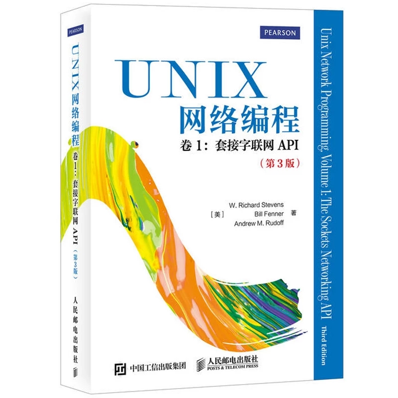
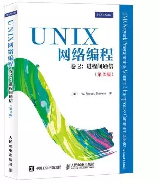
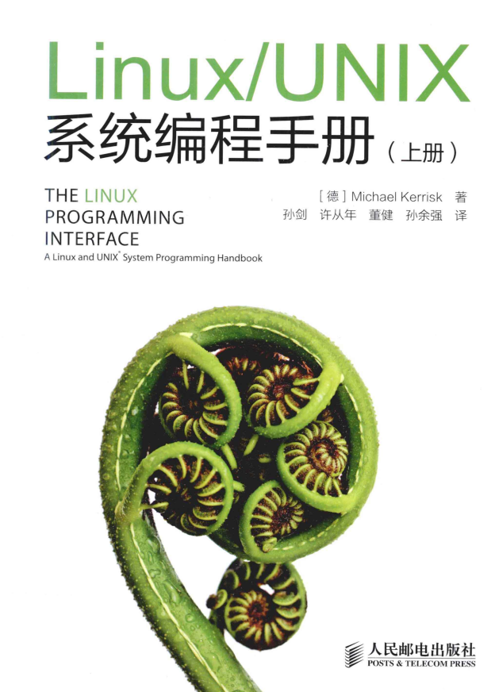
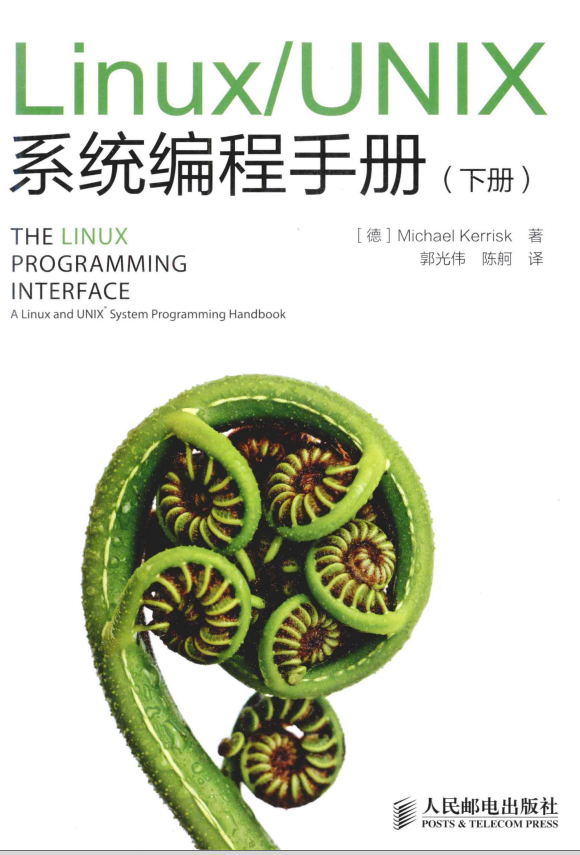

# 网络编程  

专业：网络工程；  

时间：2015级培养方案中，大三下； 

老师：赵传刚(15级)，曹佳；  

---

## 教材书籍

《UNIX 网络编程》**卷1**、卷2；  

   

    

作者：(美) **W. Richard Stevens** Bill Fenner Andrew M. Rudoff   

电子版书籍：版权原因，在计协FTP(需要连接校园网)：`ftp://202.204.121.93/计算机教学资料/` Book书目录中；  

---

## 考试

### 2015级版本的范围

网工的专业选修课(必须选的那种) ，闭卷考试，主要是考卷1，有课设；  

TCP 状态机 ；连接管理：三次握手，四次挥手;     

SOCKET API 的使用及与TCP连接管理之间的关系;     

I/O 复用：select ，epoll；     

SOCKET options：fcntl；ioctl；      

udp 协议 ，编程基础；      

域名解析，地址转换函数使用；     

I/O 模型：阻塞、非阻塞；同步、异步；    

锁，条件变量，信号量 的基本概念与使用;   

POSIX 信号处理，signal，sigaction 的使用;    

守护进程，僵尸进程;     

高级I/O ：14 章；  

非阻塞 I/O：16 章；     

多线程，多进程；  

---

## 推荐书籍： 

《Linux/Unix 系统编程手册》，上下两卷，作者： Michael Kerrisk    

   

    

电子版书籍：版权原因，在计协FTP(需要连接校园网)：`ftp://202.204.121.93/计算机教学资料/` Book书目录中；  

强烈建议抱着这套书死啃~  (记得看勘误...)    

## 参考资料  

1. [B 站视频课程](https://search.bilibili.com/all?keyword=%E7%BD%91%E7%BB%9C%E7%BC%96%E7%A8%8B&from_source=banner_search&order=totalrank&duration=4&tids_1=0)  
2. [CSDN 专栏：高性能网络编程](https://blog.csdn.net/russell_tao/column/info/high-perf-network)  

